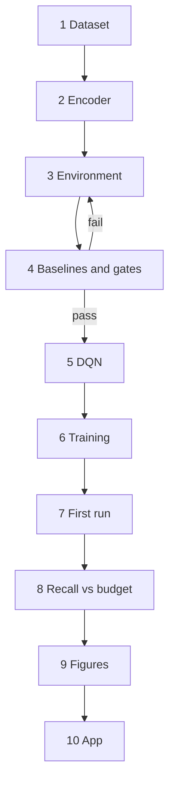

# Zoom Search Agent — Implementation Guide

Sep 27, 2026 · @Neehar

Compute-Aware Coarse-to-Fine Visual Search for Small-Object Localization in High-Resolution Imagery using Deep Reinforcement Learning.

Each step ends with a check. Do not start the next one until it passes.

> **One global substitution.** Steps 4, 6, 8 and 10 were written against an earlier data source and still say `CanvasSet("data/canvases/train")` and `CanvasSet("data/canvases/test")`. Read those as `MVTecDefects(split="train")` and `MVTecDefects(split="test")` throughout. The interface is identical, so nothing else in those steps changes.

## Step 0. Setup

### The idea in one paragraph

A photograph of a manufactured part, resized to 1024 pixels, holds one small defect. Looking at the whole canvas at once means downsampling it to 224 pixels, where the target is almost invisible. Looking everywhere at full resolution costs 64 model evaluations. The agent instead starts at the whole canvas, repeatedly picks one quadrant to descend into, and commits when it believes the target is inside the current region. It spends full resolution only where it chose to look.

### Repository

```
zoom-search-rl/
  data/
    mvtec/                  MVTec AD: extracted here, or mounted on Kaggle
  zsrl/
    __init__.py
    dataset.py              Step 1: MVTec loading, mask to box
    encoder.py              Step 2
    env.py                  Step 3
    baselines.py            Step 4
    corruptions.py          Step 8
    agents/
      __init__.py
      dqn.py                Step 5    YOURS
      ppo.py                          member 2
      a2c.py                          member 3
  scripts/
    check_dataset.py        Step 1
    check_env.py            Step 4
    train.py                Step 6
    evaluate.py             Step 8
    analyse.py              Step 9
  app/streamlit_app.py      Step 10
  runs/                     checkpoints and logs, gitignored
  results/                  figures and CSVs, committed
```

### Dependencies

```bash
python -m venv .venv && source .venv/bin/activate
pip install torch torchvision numpy pillow matplotlib pandas scipy streamlit tqdm
```

### Device handling, in `zsrl/__init__.py`

```python
import torch

CANVAS = 1024          # canvas side in pixels
MAX_DEPTH = 4          # deepest level, region is 64px
MIN_COMMIT_DEPTH = 3   # cannot commit above this


def get_device():
    if torch.cuda.is_available():
        return torch.device("cuda")
    if torch.backends.mps.is_available():
        return torch.device("mps")
    return torch.device("cpu")
```

Those three constants are used everywhere. Change them in one place or not at all.

### The tree

| Depth | Region size | Nodes at this depth | Exhaustive cost to here |
| --- | --- | --- | --- |
| 0 | 1024 | 1 | 1 |
| 1 | 512 | 4 | 5 |
| 2 | 256 | 16 | 21 |
| 3 | 128 | 64 | 85 |
| 4 | 64 | 256 | 341 |

The headline number comes from this table. Exhaustive search to depth 3 costs 64 evaluations of the leaves alone. A correct descent costs 3. Your agent, with a budget of 12, has room to make mistakes and back out and still beat exhaustive search by a factor of five.

### Build order



Step 4 is a gate. Your teammates do not write PPO or A2C until it passes, because until then a failing agent and a broken environment look identical.

## Step 1. The dataset

**MVTec AD.** Real photographs of manufactured parts, one defect region per image, with pixel-accurate masks supplied. Nothing is generated, nothing is synthesised. You read their files.

### Why this one

| Requirement | How MVTec meets it |
| --- | --- |
| Open and ready to use | Free for research, mirrored on Kaggle, attach and go |
| Large images | 700 to 1024 pixels square depending on category |
| Small targets | Many defects occupy well under 5% of the frame |
| Boxes without annotation work | Ground-truth masks are provided; the box is the mask's extent |
| One target per image | Matches the formulation exactly |
| Results likely to work | PatchCore and SPADE, the leading methods on this data, run frozen ImageNet ResNet features over patches. That is your encoder, so there is published evidence the representation carries signal here |
| Feeds the main project | InspectRL inspects manufactured parts. Same data, same domain |
| Nobody in your class has it | Manufacturing is completely open |

### Getting it

**On Kaggle**, which is where your training runs happen: search the datasets for MVTec AD, click Add Data, and it mounts under `/kaggle/input/`. No download, no unzip.

**On your Mac**, for development: download the archive from MVTec's site, registration is free, and extract to `data/mvtec/`.

Set one variable and the same code runs in both places:

```python
import os
MVTEC_ROOT = os.environ.get("MVTEC_ROOT", "data/mvtec")
```

### How the files are laid out

```
mvtec/
  bottle/
    train/good/000.png              defect-free, no mask
    test/good/000.png               defect-free
    test/broken_large/000.png       defective
    test/contamination/000.png      defective
    ground_truth/broken_large/000_mask.png
    ground_truth/contamination/000_mask.png
  cable/ ...
  capsule/ ...
  (15 categories)
```

Every defective test image has a mask at the matching path with `_mask` appended. Defect-free images have no mask, which is correct, and they become the negative examples the main project needs later.

### `zsrl/dataset.py`

```python
import glob
import os

import numpy as np
from PIL import Image

from zsrl import CANVAS

MVTEC_ROOT = os.environ.get("MVTEC_ROOT", "data/mvtec")

CATEGORIES = ("bottle", "cable", "capsule", "carpet", "grid",
              "hazelnut", "leather", "metal_nut", "pill", "screw",
              "tile", "toothbrush", "transistor", "wood", "zipper")


def box_from_mask(mask_path, out_size=CANVAS):
    """Bounding box of the defect, in coordinates of the resized image."""
    m = np.array(Image.open(mask_path).convert("L"))
    ys, xs = np.nonzero(m)
    if len(xs) == 0:
        return None
    h, w = m.shape
    sx, sy = out_size / w, out_size / h
    return (float(xs.min()) * sx, float(ys.min()) * sy,
            float(xs.max() + 1) * sx, float(ys.max() + 1) * sy)


class MVTecDefects:
    """Defective MVTec images with a box derived from the supplied mask.

    Same interface the environment expects:
        len(ds), ds[i] -> (image_path, box, label, key)
    Boxes are in coordinates of the image AFTER resizing to CANVAS.
    """

    def __init__(self, root=MVTEC_ROOT, categories=CATEGORIES,
                 max_area_frac=0.05, min_side=12.0,
                 split="train", split_frac=0.8, seed=0):
        records = []

        for cat in categories:
            gt_dir = os.path.join(root, cat, "ground_truth")
            if not os.path.isdir(gt_dir):
                continue
            for defect in sorted(os.listdir(gt_dir)):
                for mask_path in sorted(glob.glob(
                        os.path.join(gt_dir, defect, "*_mask.png"))):
                    stem = os.path.basename(mask_path).replace("_mask.png", "")
                    img_path = os.path.join(root, cat, "test", defect, stem + ".png")
                    if not os.path.exists(img_path):
                        continue

                    box = box_from_mask(mask_path)
                    if box is None:
                        continue
                    bw, bh = box[2] - box[0], box[3] - box[1]
                    if bw < min_side or bh < min_side:
                        continue
                    if (bw * bh) > max_area_frac * CANVAS * CANVAS:
                        continue

                    records.append({
                        "image_path": img_path,
                        "box": box,
                        "label": cat + "/" + defect,
                        "key": cat + "|" + defect + "|" + stem,
                        "category": cat,
                    })

        rng = np.random.default_rng(seed)
        order = rng.permutation(len(records))
        cut = int(split_frac * len(records))
        keep = order[:cut] if split == "train" else order[cut:]
        self.records = [records[int(i)] for i in keep]

    def __len__(self):
        return len(self.records)

    def __getitem__(self, i):
        r = self.records[i]
        return r["image_path"], r["box"], r["label"], r["key"]

    def categories(self):
        from collections import Counter
        return Counter(r["category"] for r in self.records)
```

### One change in the environment

MVTec images vary between 700 and 1024 pixels depending on category. The tree assumes a fixed size, so resize on load. In `ZoomSearchEnv.reset`, one line changes:

```python
img = Image.open(path).convert("RGB").resize((CANVAS, CANVAS))
```

That is why `box_from_mask` already returns coordinates scaled to `CANVAS`. Nothing else in this guide changes: `CanvasSet` becomes `MVTecDefects` and every other file is untouched, because the interface is identical.

### The three filters, and why

**`max_area_frac=0.05`.** Keeps only defects occupying under 5% of the frame. Large dents and tears are visible at depth 1 and make the task trivial. Small scratches are the whole point.

**`min_side=12`.** A defect under 12 pixels after resizing is smaller than the encoder can resolve even at depth 4. Those episodes are unwinnable and only add noise.

**Bounding box of the whole mask.** Some images have several disconnected defect spots. Taking the extent of all of them gives a large box, which then fails the area filter and drops out. That is the behaviour you want, and it is worth saying out loud rather than pretending every image has exactly one blob.

### The check

```python
import matplotlib.pyplot as plt
import matplotlib.patches as patches
from PIL import Image

from zsrl import CANVAS
from zsrl.dataset import MVTecDefects

train = MVTecDefects(split="train")
test = MVTecDefects(split="test")
print("train", len(train), "test", len(test))
print(train.categories())

fig, axes = plt.subplots(2, 4, figsize=(18, 9))
for ax, i in zip(axes.ravel(), range(8)):
    path, box, label, key = train[i]
    ax.imshow(Image.open(path).convert("RGB").resize((CANVAS, CANVAS)))
    x1, y1, x2, y2 = box
    ax.add_patch(patches.Rectangle((x1, y1), x2 - x1, y2 - y1,
                                   fill=False, lw=2, edgecolor="lime"))
    for k in range(1, 8):
        ax.axhline(k * CANVAS / 8, lw=0.3, color="white")
        ax.axvline(k * CANVAS / 8, lw=0.3, color="white")
    ax.set_title(label, fontsize=9)
    ax.axis("off")
plt.tight_layout()
plt.savefig("results/dataset_check.png", dpi=110)
```

**Expect roughly:** 600 to 900 usable defective images across the 15 categories, split 80/20. If you get far fewer, raise `max_area_frac` to 0.08. If almost all of them survive, lower it to 0.03, because the defects are not small enough to make searching worthwhile.

**Passes when:** the green box sits on something visibly wrong with the part, and the defect is comparable to one cell of the overlaid depth-3 grid or smaller. If you cannot see the defect yourself at full size, the agent has no chance and that image should be filtered out.

Keep `results/dataset_check.png`. It is your first slide, and a better one than a synthetic collage would have been, because these are photographs of real broken parts.

## Step 2. The frozen encoder

This is the expensive operation the whole project is about budgeting. Every time the agent looks at a region, that region is cropped, resized to 224, and pushed through a frozen ResNet-18. **One encoder call is one unit of compute.** That is the currency of every result you will report.

### `zsrl/encoder.py`

```python
import numpy as np
import torch
import torch.nn as nn
import torchvision.transforms as T
from torchvision.models import resnet18, ResNet18_Weights


class FrozenEncoder:
    dim = 512

    def __init__(self, device, cache_size=400_000):
        net = resnet18(weights=ResNet18_Weights.IMAGENET1K_V1)
        net.fc = nn.Identity()
        for p in net.parameters():
            p.requires_grad = False
        self.net = net.eval().to(device)
        self.device = device

        self.tf = T.Compose([
            T.Resize((224, 224)),
            T.ToTensor(),
            T.Normalize([0.485, 0.456, 0.406], [0.229, 0.224, 0.225]),
        ])

        self.cache = {}
        self.cache_size = cache_size
        self.calls = 0        # every real forward pass, the compute counter
        self.hits = 0

    @torch.no_grad()
    def encode_pil(self, pil_image):
        x = self.tf(pil_image).unsqueeze(0).to(self.device)
        return self.net(x).squeeze(0).float().cpu().numpy()

    def encode_node(self, pil_image, image_key, node):
        """node is (depth, row, col). Exact key, no quantisation needed."""
        key = (image_key, node)
        cached = self.cache.get(key)
        if cached is not None:
            self.hits += 1
            return cached

        self.calls += 1
        from zsrl.env import node_box
        x1, y1, x2, y2 = node_box(node)
        feat = self.encode_pil(pil_image.crop((x1, y1, x2, y2)))
        if len(self.cache) < self.cache_size:
            self.cache[key] = feat
        return feat

    def reset_counter(self):
        self.calls = 0

    def stats(self):
        total = self.calls + self.hits
        return {"calls": self.calls, "hits": self.hits,
                "hit_rate": self.hits / total if total else 0.0,
                "entries": len(self.cache)}
```

### Three things that matter here

**The cache key is exact, not quantised.** The tree has finitely many nodes: 341 per canvas down to depth 4. So you can key on the node tuple directly and every repeat visit is free. This is much cleaner than the sliding-box case, and it is why this project trains fast.

**`calls` is the compute counter.** It increments only on a real forward pass. During *evaluation* you reset it per episode and report it, and that number is the x-axis of your headline plot. During *training* you leave it alone.

**Careful: caching and the compute metric conflict.** If the same canvas appears twice in evaluation, the second pass is free from the cache but should still count as compute in a real system. So in `scripts/evaluate.py` you will use a fresh encoder per method, and count nodes visited rather than trusting `calls`. Step 8 handles this; just know now that it exists.

**Freezing is not an optimisation, it is the design.** All three agents see identical features, so any difference between them is the learning algorithm. Say this in the viva.

**Revised after the full 12,000-episode run: global average pooling was
discarding the one thing this task needs.** The guide's version above
(`net.fc = nn.Identity()`, take the model's own globally-pooled 512-vector)
is what shipped for Steps 1-7. Once training converged, reframing recall as
per-level accuracy (`a = recall^(1/3)`, chance 0.25 -- see
`results/baseline_notes.md`) showed the agent plateaued at `a = 0.431` and
would not move with more training. Global average pooling collapses the
7x7 spatial map into one number per channel: it answers "what's broadly in
this view," not "where in this view it is" -- exactly the information
needed to tell which quadrant holds the defect. `FrozenEncoder.encode_pil`
now bypasses the resnet's own `avgpool`/`fc` and instead pools `layer4`'s
`(512, 7, 7)` output to `(512, 2, 2)` with `F.adaptive_avg_pool2d`, then
reshapes to four contiguous 512-dim blocks in `[TL, TR, BL, BR]` order
(verified against `node_box`'s row/col convention with a direct shape test
before use). `dim` is 2048, not 512, and one encoder call on a parent node
now yields a summary for each of its four future children in a single
pass. `state_dim` follows automatically through the existing formula in
`ZoomSearchEnv.__init__` (2048 + 5 + 4 + 1 + 24 = 2082); `QNetwork` scales
with it (`2082-512-256-6`). See `results/spatial_pooling_notes.md` for the
full diagnosis and before/after numbers. If you are building this project
from scratch rather than following its history, use the 2x2-pooled version
from the start -- the global-average-pool version above is kept here as a
record of why, not as the recommended implementation.

### The check

```python
import time
from PIL import Image
from zsrl import get_device
from zsrl.canvas import CanvasSet
from zsrl.encoder import FrozenEncoder

enc = FrozenEncoder(get_device())
path, box, label, key = CanvasSet("data/canvases/train")[0]
img = Image.open(path).convert("RGB")

root = enc.encode_node(img, key, (0, 0, 0))
child = enc.encode_node(img, key, (1, 0, 0))
print("shape", root.shape)
print("root vs child distance", float(((root - child) ** 2).sum() ** 0.5))

t0 = time.time()
for _ in range(300):
    enc.encode_node(img, key, (0, 0, 0))
print("300 repeats in", round(time.time() - t0, 3), "s", enc.stats())
```

**Passes when:** shape is `(512,)`, the root-to-child distance is clearly non-zero (the agent must be able to tell a zoomed view from the whole view, or it has no signal at all), and 300 repeats finish in a fraction of a second with a hit rate near 1.0.

If the root and child features are nearly identical, check `node_box` from Step 3, because you are probably encoding the same crop twice.

## Step 3. The quadtree environment

### The MDP

**Node.** A tuple `(depth, row, col)`. The root is `(0, 0, 0)`.

**State**, 546 numbers:

| Part | Size | What it is |
| --- | --- | --- |
| Encoded view of the current region | 512 | What the agent can see right now |
| Depth, one-hot | 5 | How far in it has zoomed |
| Region position and size, normalised | 4 | Where it is on the canvas |
| Budget remaining, normalised | 1 | How much compute is left |
| Last 4 actions, one-hot | 24 | What it has already tried |

**Actions**, 6: descend into top-left, top-right, bottom-left, bottom-right; go back up; commit.

**Dynamics.** Deterministic tree navigation. Invalid actions are masked, never taken.

**Reward.**

| Event | Reward |
| --- | --- |
| Descend into a quadrant containing the target centre, first visit this episode | +1 minus lambda |
| Descend into a quadrant not containing it, first visit this episode | minus 1 minus lambda |
| Descend into any quadrant already visited this episode | minus lambda only |
| Go back up | minus 0.2 |
| Commit, region contains the centre, depth at least 3 | +3 |
| Commit, anything else | minus 1 |
| Budget exhausted without committing | minus 3 |

Lambda is the cost of one full-resolution evaluation, default 0.1. It is the knob that trades accuracy against compute, and sweeping it gives you an extra figure in Step 9.

**First-visit descent reward -- a fix, added deliberately, not part of the
original design.** The first single-image overfit run passed on return (5.7)
and steps (4) at episodes 300 and 350, but episodes 200 and 250 revealed a
reward exploit: a down-up-down cycle into the *same correct* node pays +0.9
(descend) - 0.2 (up) + 0.9 (redescend) = +0.7 net, repeatable for free
across the whole 12-step budget with no localisation progress -- exactly
what happened at ep 200 (return 5.3, 12 steps, no commit) and ep 250 (return
2.2, 12 steps, no commit). The dense per-descent reward was farmable because
it was paid every time a node was entered, regardless of whether the agent
had already been there.

The fix: the environment now tracks the set of nodes visited so far this
episode (`ZoomSearchEnv.visited_nodes`, reset every `reset()`). The +1/-1
component of the descent reward is paid only the *first* time a node is
entered in an episode; every later re-entry to that node pays the lambda
compute cost alone, with no +1/-1 term either way. Going up is untouched
(still a flat -0.2), and nothing about the state or action space changes --
a node's first-visit status is not fed into the state, so this is a change
to the reward function only, not to what the agent observes. Concretely this
kills the farm: a down-up-down cycle now nets +0.9 - 0.2 - 0.1 = +0.6 the
*first* time (still fine, that's genuine progress), but only -0.2 - 0.1 =
-0.3 on every repeat, since the redescend no longer pays +1. This is a
practical, potential-based shaping fix -- it removes a reward cycle without
changing what optimal behaviour looks like (the shortest correct path, which
never revisits a node, gets an identical return to before) -- not a
redesign of the reward function. See `results/reward_shaping_notes.md` for
the before/after overfit curves.

**Terminal reward rebalance -- a second fix, found the same way.** With the
first-visit fix in place, the first 2000-episode real-data training run
(random image per episode, not a single-image overfit) showed a different
failure: `committed_rate` and `mean_depth` fell monotonically as epsilon
decayed (0.873 to 0.036, and 3.59 to 1.13, over episodes 250-1750), and the
greedy eval policy never committed once, at any checkpoint (`eval_cost`
pinned at exactly 12.0 throughout). The agent was learning to refuse the
task.

The mechanism: with a wrong commit at -3 and a correct commit at +3, the
expected value of attempting to commit at localisation accuracy `p` is
`E[commit] = 3p - 3(1-p) = 6p - 3`, negative for any `p < 0.5`. Timing out
without committing paid exactly 0 -- a safe, guaranteed escape that beats a
losing gamble. A depth-1 accuracy of 0.575 (see the normal-model
learnability diagnostic above) compounds to well under 50% by depth 3, so a
partly-trained agent correctly judged commit a losing bet and learned to run
out the clock instead. This is self-reinforcing: improving localisation
requires committing and learning from the outcome, but committing is
punished until localisation is already good, so the policy cannot bootstrap
its way out once it collapses into refusing.

The fix, two changes, nothing else: wrong commit becomes -1 (was -3);
timing out without committing becomes -3 (was 0) -- there is no longer a
free option to give up. Together, `E[commit] = 3p - 1(1-p) = 4p - 1`, positive
for any `p > 0.25` (break-even accuracy `p* = R_bad / (R_good + R_bad) =
1 / (3 + 1) = 0.25`), and a guaranteed -3 for timing out is worse than
attempting a commit at *any* non-zero accuracy. Attempting the task now
always beats refusing it. Nothing about the state, action space, masking,
descent rewards or the first-visit rule changed -- only the two terminal
reward values. The single-image overfit ceiling is unaffected (the optimal
path never times out or commits incorrectly, so its return is still
2.7 + 3 = 5.7). See `results/reward_shaping_notes.md` for the diagnostic
data and the re-run curves.

**Budget.** 12 steps. A perfect descent needs 3, so there is room to make mistakes and back out.

### `zsrl/env.py`

```python
from collections import deque

import numpy as np
from PIL import Image

from zsrl import CANVAS, MAX_DEPTH, MIN_COMMIT_DEPTH

TL, TR, BL, BR, UP, COMMIT = 0, 1, 2, 3, 4, 5
N_ACTIONS = 6
ACTION_NAMES = ["top-left", "top-right", "bottom-left", "bottom-right",
                "back up", "commit"]


def node_box(node, canvas=CANVAS):
    depth, row, col = node
    size = canvas // (2 ** depth)
    return (col * size, row * size, (col + 1) * size, (row + 1) * size)


def child(node, quadrant):
    depth, row, col = node
    return (depth + 1, 2 * row + quadrant // 2, 2 * col + quadrant % 2)


def parent(node):
    depth, row, col = node
    return (depth - 1, row // 2, col // 2)


def contains_centre(node, box, canvas=CANVAS):
    cx = (box[0] + box[2]) / 2.0
    cy = (box[1] + box[3]) / 2.0
    x1, y1, x2, y2 = node_box(node, canvas)
    return x1 <= cx < x2 and y1 <= cy < y2


def legal_actions(node, max_depth=MAX_DEPTH, min_commit=MIN_COMMIT_DEPTH):
    depth = node[0]
    mask = np.zeros(N_ACTIONS, dtype=bool)
    if depth < max_depth:
        mask[TL:BR + 1] = True
    if depth > 0:
        mask[UP] = True
    if depth >= min_commit:
        mask[COMMIT] = True
    return mask


class ZoomSearchEnv:
    def __init__(self, canvases, encoder, budget=12, lam=0.1,
                 history_len=4, corruption=None, corruption_tag="clean", seed=0):
        self.canvases = canvases
        self.encoder = encoder
        self.budget = budget
        self.lam = lam
        self.history_len = history_len
        self.corruption = corruption
        self.corruption_tag = corruption_tag
        self.rng = np.random.default_rng(seed)
        self.state_dim = encoder.dim + (MAX_DEPTH + 1) + 4 + 1 + history_len * N_ACTIONS

    def reset(self, index=None):
        if index is None:
            index = int(self.rng.integers(len(self.canvases)))
        path, box, label, key = self.canvases[index]

        img = Image.open(path).convert("RGB")
        if self.corruption is not None:
            img = self.corruption(img)
        self.image = img
        self.image_key = key + "|" + self.corruption_tag

        self.target = box
        self.label = label
        self.node = (0, 0, 0)
        self.history = deque(maxlen=self.history_len)
        self.t = 0
        self.visited = [self.node]
        return self._state()

    def _state(self):
        feat = self.encoder.encode_node(self.image, self.image_key, self.node)

        depth_oh = np.zeros(MAX_DEPTH + 1, dtype=np.float32)
        depth_oh[self.node[0]] = 1.0

        x1, y1, x2, y2 = node_box(self.node)
        pos = np.array([x1 / CANVAS, y1 / CANVAS,
                        (x2 - x1) / CANVAS, (y2 - y1) / CANVAS], dtype=np.float32)

        left = np.array([(self.budget - self.t) / self.budget], dtype=np.float32)

        hist = np.zeros(self.history_len * N_ACTIONS, dtype=np.float32)
        for i, a in enumerate(self.history):
            hist[i * N_ACTIONS + a] = 1.0

        return np.concatenate([feat, depth_oh, pos, left, hist]).astype(np.float32)

    def legal(self):
        return legal_actions(self.node)

    def step(self, action):
        self.t += 1

        if action == COMMIT:
            ok = (contains_centre(self.node, self.target)
                  and self.node[0] >= MIN_COMMIT_DEPTH)
            reward = 3.0 if ok else -3.0
            info = {"success": bool(ok), "committed": True, "steps": self.t,
                    "depth": self.node[0], "node": self.node}
            return self._state(), reward, True, info

        if action == UP:
            self.node = parent(self.node)
            reward = -0.2
        else:
            self.node = child(self.node, action)
            reward = (1.0 if contains_centre(self.node, self.target) else -1.0) - self.lam

        self.history.appendleft(action)
        self.visited.append(self.node)

        done = self.t >= self.budget
        info = {"success": False, "committed": False, "steps": self.t,
                "depth": self.node[0], "node": self.node}
        return self._state(), reward, done, info
```

### Six things to be able to explain

**Why the state carries depth, position and budget.** The encoded crop alone is ambiguous: a 128-pixel region and a 1024-pixel region both arrive as 224-pixel images, so the agent cannot tell how zoomed in it is from pixels alone. Depth and size tell it. Budget tells it whether it can afford to back out. Without these the problem is not Markov, and this is a likely viva question.

**Why action masking rather than penalties.** Letting the agent pick an illegal action and punishing it wastes training on learning the rules of the tree rather than the task. Masking removes them from consideration entirely. Step 5 shows how.

**Why commit is blocked above depth 3.** Committing at the root would be trivially correct, since the root contains everything. The minimum depth is what forces actual localisation.

**Why the reward for descending is dense.** The agent gets feedback on every descent, not just at the end. Sparse terminal-only reward on a tree of depth 4 would need far more episodes to learn. Say that you chose dense shaping deliberately and why.

**Why centre-containment rather than IoU.** A quadtree cell either holds the target's centre or it does not. It is unambiguous, it is cheap, and it matches how the tree partitions space. You still record the IoU of the committed region with the target box as a secondary quality metric.

**Why lambda appears only on descents.** Descending is what costs a full-resolution model evaluation. Going up is free in compute terms, which is why it carries only a small nuisance penalty to discourage dithering.

### The optimal policy, for reference

On a clean canvas, the shortest correct episode is: descend, descend, descend, commit. Four steps, three encoder calls after the root, reward roughly 3 times (1 minus 0.1) plus 3, which is about 5.7.

That number is your ceiling. Write it down; you will compare every agent against it.

## Step 4. Baselines and the gate

Build the baselines **before** the agent. They tell you what the task is worth, they are your floor and ceiling, and three of them cost about twenty lines each.

### `zsrl/baselines.py`

```python
import numpy as np
from PIL import Image

from zsrl import MAX_DEPTH, MIN_COMMIT_DEPTH
from zsrl.env import child, contains_centre, node_box


def oracle(target, depth=MIN_COMMIT_DEPTH):
    """Always descends correctly. Cost = depth. This is the ceiling."""
    node = (0, 0, 0)
    for _ in range(depth):
        for q in range(4):
            c = child(node, q)
            if contains_centre(c, target):
                node = c
                break
    return {"success": True, "cost": depth, "node": node}


def random_descent(target, rng, budget=12, depth=MIN_COMMIT_DEPTH):
    """Random quadrant each step. The floor."""
    node, cost = (0, 0, 0), 0
    while node[0] < depth and cost < budget:
        node = child(node, int(rng.integers(4)))
        cost += 1
    return {"success": contains_centre(node, target) and node[0] >= depth,
            "cost": cost, "node": node}


def saliency_descent(image, target, budget=12, depth=MIN_COMMIT_DEPTH):
    """Descend into the child with the highest pixel variance.
    A sensible engineer's solution, and a genuinely tough opponent."""
    node, cost = (0, 0, 0), 0
    while node[0] < depth and cost + 4 <= budget:
        scores = []
        for q in range(4):
            c = child(node, q)
            crop = image.crop(node_box(c)).resize((64, 64))
            scores.append(float(np.asarray(crop, dtype=np.float32).var()))
            cost += 1
        node = child(node, int(np.argmax(scores)))
    return {"success": contains_centre(node, target) and node[0] >= depth,
            "cost": cost, "node": node}


def exhaustive(target, depth=MIN_COMMIT_DEPTH):
    """Visit every node at the target depth. Always succeeds, always expensive."""
    return {"success": True, "cost": 4 ** depth, "node": None}
```

**This is the guide's original version.** The actual `zsrl/baselines.py` differs:
`saliency_descent` now scores quadrants by distance from their siblings
(`odd_one_out_scores`) rather than raw pixel variance, and there's an added
`normal_model_descent` using a `train/good/`-derived reference. See the
measured-numbers section below "The check" for why, and
`scripts/build_normal_reference.py` for how the reference is built.

### Note what the saliency baseline costs

It evaluates all four children before choosing, so descending three levels costs 12 evaluations, not 3. Your agent evaluates one child per step. That is the structural advantage the RL formulation has, and it is worth stating explicitly in the presentation: the learned policy commits to a direction from the parent view, the heuristic has to look at every option.

### `scripts/check_env.py`

```python
import numpy as np
from PIL import Image

from zsrl.baselines import exhaustive, oracle, random_descent, saliency_descent
from zsrl.canvas import CanvasSet

cs = CanvasSet("data/canvases/test")
rng = np.random.default_rng(0)

rows = {"oracle": [], "random": [], "saliency": [], "exhaustive": []}
for i in range(200):
    path, box, label, key = cs[i]
    img = Image.open(path).convert("RGB")
    rows["oracle"].append(oracle(box))
    rows["random"].append(random_descent(box, rng))
    rows["saliency"].append(saliency_descent(img, box))
    rows["exhaustive"].append(exhaustive(box))

for name, rs in rows.items():
    rec = float(np.mean([r["success"] for r in rs]))
    cost = float(np.mean([r["cost"] for r in rs]))
    print(f"{name:12s} recall {rec:.3f}   mean cost {cost:.1f}")
```

**Measured on the actual MVTec test split (134 images, n varies per category):**

| Method | Recall | Cost |
| --- | --- | --- |
| Oracle | 1.000 | 3.0 |
| Exhaustive | 1.000 | 64.0 |
| `normal_model_descent` | 0.187 | 12.0 |
| `saliency_descent` | 0.134 | 12.0 |
| Random | 0.022 | 3.0 |

Random should be near 1 in 64, because three independent quarter-chances is 1.6%. If it is much higher, something in `contains_centre` is wrong.

**Corrected from the guide's original 0.3-0.6 saliency expectation.** That range
was calibrated on VOC natural photos, before this project switched to MVTec,
and it does not transfer. The first `scripts/check_env.py` run on MVTec scored
saliency (max pixel-variance quadrant) at 0.052 recall -- at or below the
0.25-per-level chance rate you'd see from picking blind, because on MVTec's
tightly-controlled industrial closeups, busy but defect-free texture (screw
threads, fabric weave, wood grain) generates more raw pixel variance than a
subtle scratch or contamination spot does. A per-category breakdown confirmed
it: saliency scored 0 recall on 9 of 14 categories (screw, zipper, capsule,
pill, cable, bottle, tile, toothbrush, transistor, metal_nut) and only
marginal hits on textured categories. This is a property of the dataset, not
a bug -- oracle, random and exhaustive all landed exactly on their theoretical
values in the same run, which independently confirms `child`, `contains_centre`,
`node_box` and the masking/budget logic are correct.

`saliency_descent` was changed to an "odd-one-out" heuristic instead of raw
variance: at each level, score a quadrant by its squared distance from the
mean of its three siblings (see `zsrl.baselines.odd_one_out_scores`). A
defect breaking a repeating pattern stands out from its neighbours even when
it isn't the highest-variance region in absolute terms. This raised recall to
0.134 -- better, but still nowhere near 0.3-0.6, which no classical pixel
heuristic should be expected to reach on defects this subtle by design.

**Is the task even learnable? A diagnostic using `train/good/`.** Before
trusting any of this, we checked whether the frozen ResNet-18 features
separate quadrants at all. For each category, we averaged the encoder's
depth-1 quadrant features over every defect-free `train/good/` image, giving
a per-category, per-quadrant-position "normal" reference. For each test
image, we encoded its four depth-1 quadrants and picked whichever was
furthest (Euclidean distance) from the matching reference -- i.e. "which
quadrant looks least normal for this category." Chance is 0.25.

**Result: 0.575 accuracy at depth 1 alone** (n=134; bottle 1.00, transistor
0.80, carpet 0.79, leather 0.76, pill 0.69, cable 0.60 down to metal_nut
0.20, toothbrush 0/1). Well above chance -- the encoder features do carry
real, usable signal about where the defect is, at least for the first,
highest-leverage decision. This is the basis for `normal_model_descent`
above: it uses the reference-distance choice at depth 1, then falls back to
`odd_one_out_scores` for depths 2 and 3, because building a reference at
those deeper levels needs ~20x more `train/good/` images encoded (84
node-positions instead of 4) -- hours on a CPU kernel, for a classical
baseline. That's also why its full depth-3 recall (0.187) undershoots its
own depth-1 number: the odd-one-out fallback fails outright (0 recall) on
rigid single-object categories -- bottle, screw, transistor, metal_nut --
even where the depth-1 reference-distance choice alone was strong on those
same categories. Rebuild the reference with
`python -m scripts.build_normal_reference` (writes
`runs/baselines/normal_reference.npz`, gitignored and regenerable) before
running `scripts/check_env.py`, which will otherwise skip that row.

**Write these numbers down.** They are the reference rows in every results
table you produce, and the target your agent has to beat: better recall than
`normal_model_descent` at no worse cost. The depth-1 learnability number
(0.575 vs. 0.25 chance) is the more important sanity check, though -- it is
what tells you DQN training is even worth attempting on this encoder and
dataset before you spend the compute.

### Gate: overfit one canvas

After Step 5 exists, before anything else:

```python
env = ZoomSearchEnv(CanvasSet("data/canvases/train"), encoder, seed=0)
agent = DQNAgent(env.state_dim, N_ACTIONS, device, eps_decay_steps=1500)

for ep in range(400):
    s = env.reset(index=0)
    total = 0.0
    while True:
        a = agent.act(s, env.legal())
        s2, r, done, info = env.step(a)
        agent.observe(s, a, r, s2, done, env.legal())
        agent.update()
        s, total = s2, total + r
        if done:
            break
    if ep % 50 == 0:
        print(ep, "return", round(total, 2), "success", info["success"],
              "steps", info["steps"])
```

**Passes when:** by episode 250 the agent reliably reaches a return near 5.7 on that one canvas, in four steps, committing successfully. It is memorising one descent path, which is exactly what it should be able to do.

**If it cannot**, work through this in order:

| Check | How |
| --- | --- |
| Is the target box right on this canvas? | Draw it with the depth-3 grid, as in Step 1 |
| Does the state change when you descend? | Print the distance between consecutive states, must be non-zero |
| Is the reward sign right? | Print node, `contains_centre`, reward for one episode and read it line by line |
| Are illegal actions being taken? | Assert `env.legal()[a]` is True before every `step` |
| Is the mask being applied in `act`? | Print the Q values and the chosen action at depth 4, where descends are illegal |

That last one catches the most common bug in this design.

## Step 5. The DQN agent

Your piece. The one thing that differs from a textbook DQN is action masking, and it has to be applied in three places or the agent silently learns nonsense.

### `zsrl/agents/dqn.py`

```python
import numpy as np
import torch
import torch.nn as nn
import torch.nn.functional as F


class QNetwork(nn.Module):
    def __init__(self, state_dim, n_actions):
        super().__init__()
        self.net = nn.Sequential(
            nn.Linear(state_dim, 512), nn.ReLU(),
            nn.Linear(512, 256), nn.ReLU(),
            nn.Linear(256, n_actions),
        )

    def forward(self, x):
        return self.net(x)


class ReplayBuffer:
    def __init__(self, capacity, state_dim, n_actions):
        self.capacity = capacity
        self.s = np.zeros((capacity, state_dim), dtype=np.float32)
        self.a = np.zeros(capacity, dtype=np.int64)
        self.r = np.zeros(capacity, dtype=np.float32)
        self.s2 = np.zeros((capacity, state_dim), dtype=np.float32)
        self.d = np.zeros(capacity, dtype=np.float32)
        self.m2 = np.zeros((capacity, n_actions), dtype=np.float32)
        self.idx, self.full = 0, False

    def add(self, s, a, r, s2, done, next_mask):
        i = self.idx
        self.s[i], self.a[i], self.r[i] = s, a, r
        self.s2[i], self.d[i] = s2, float(done)
        self.m2[i] = next_mask.astype(np.float32)
        self.idx = (i + 1) % self.capacity
        self.full = self.full or self.idx == 0

    def __len__(self):
        return self.capacity if self.full else self.idx

    def sample(self, batch_size, rng):
        ids = rng.integers(len(self), size=batch_size)
        return (self.s[ids], self.a[ids], self.r[ids],
                self.s2[ids], self.d[ids], self.m2[ids])


class DQNAgent:
    name = "dqn"

    def __init__(self, state_dim, n_actions, device,
                 lr=1e-4, gamma=0.95, buffer_size=100_000, batch_size=64,
                 target_sync=500, train_every=2, learn_start=1000,
                 eps_start=1.0, eps_end=0.05, eps_decay_steps=20_000, seed=0):
        self.device, self.n_actions = device, n_actions
        self.gamma, self.batch_size = gamma, batch_size
        self.target_sync, self.train_every = target_sync, train_every
        self.learn_start = learn_start
        self.eps_start, self.eps_end = eps_start, eps_end
        self.eps_decay_steps = eps_decay_steps

        self.online = QNetwork(state_dim, n_actions).to(device)
        self.target = QNetwork(state_dim, n_actions).to(device)
        self.target.load_state_dict(self.online.state_dict())
        self.target.eval()

        self.opt = torch.optim.Adam(self.online.parameters(), lr=lr)
        self.buffer = ReplayBuffer(buffer_size, state_dim, n_actions)
        self.rng = np.random.default_rng(seed)
        self.steps = 0

    @property
    def epsilon(self):
        frac = min(1.0, self.steps / self.eps_decay_steps)
        return self.eps_start + frac * (self.eps_end - self.eps_start)

    def q_values(self, state, mask=None):
        with torch.no_grad():
            x = torch.from_numpy(state).float().unsqueeze(0).to(self.device)
            q = self.online(x).squeeze(0).cpu().numpy()
        if mask is not None:
            q = np.where(mask, q, -np.inf)
        return q

    def act(self, state, mask, greedy=False):
        legal = np.flatnonzero(mask)
        if not greedy and self.rng.random() < self.epsilon:
            return int(self.rng.choice(legal))
        return int(np.argmax(self.q_values(state, mask)))

    def observe(self, s, a, r, s2, done, next_mask):
        self.buffer.add(s, a, r, s2, done, next_mask)
        self.steps += 1

    def update(self):
        if len(self.buffer) < self.learn_start:
            return None
        if self.steps % self.train_every != 0:
            return None

        s, a, r, s2, d, m2 = self.buffer.sample(self.batch_size, self.rng)
        s = torch.from_numpy(s).to(self.device)
        a = torch.from_numpy(a).to(self.device)
        r = torch.from_numpy(r).to(self.device)
        s2 = torch.from_numpy(s2).to(self.device)
        d = torch.from_numpy(d).to(self.device)
        m2 = torch.from_numpy(m2).to(self.device).bool()

        q = self.online(s).gather(1, a.unsqueeze(1)).squeeze(1)

        with torch.no_grad():
            NEG = torch.finfo(torch.float32).min
            q_next_online = self.online(s2).masked_fill(~m2, NEG)
            next_a = q_next_online.argmax(dim=1, keepdim=True)
            q_next_target = self.target(s2).masked_fill(~m2, NEG)
            next_q = q_next_target.gather(1, next_a).squeeze(1)
            next_q = torch.nan_to_num(next_q, neginf=0.0)
            y = r + self.gamma * (1.0 - d) * next_q

        loss = F.smooth_l1_loss(q, y)

        self.opt.zero_grad()
        loss.backward()
        nn.utils.clip_grad_norm_(self.online.parameters(), 10.0)
        self.opt.step()

        if self.steps % self.target_sync == 0:
            self.target.load_state_dict(self.online.state_dict())

        return float(loss.item())

    def save(self, path):
        torch.save({"online": self.online.state_dict(), "steps": self.steps}, path)

    def load(self, path):
        ck = torch.load(path, map_location=self.device)
        self.online.load_state_dict(ck["online"])
        self.target.load_state_dict(ck["online"])
        self.steps = ck.get("steps", 0)
```

### The masking, which is the only tricky part

It has to appear in three places:

**In `act`.** Random exploration picks only from legal actions, and the greedy choice takes the argmax over masked Q values. Get this wrong and the agent proposes illegal moves.

**In the buffer.** You store the *next* state's mask alongside the transition. This is the bit people forget. You need it later, and you cannot recompute it, because the buffer holds state vectors and not environment objects.

**In the target computation.** Both the action selection and the valuation in the next state must be masked. `masked_fill(~m2, NEG)` sets illegal actions to the most negative float so they never win the argmax.

The `nan_to_num` line is defensive: on a terminal transition every entry of `m2` can be false, and masking everything gives negative infinity, which multiplied by the zero from `(1 - d)` produces NaN. One NaN poisons the whole network in a single backward pass. That line costs nothing and saves an afternoon.

### Why these hyperparameters differ from a textbook DQN

| Setting | Value | Why |
| --- | --- | --- |
| Network | 512 then 256 | Episodes are \~6 steps and the action space is 6. A smaller head trains faster and overfits less |
| Gamma | 0.95 | Horizon is 12 steps, not hundreds |
| Target sync | 500 | Episodes are short, so 1000 steps is many episodes and the target goes stale |
| Epsilon decay | 20,000 steps | About 3000 episodes at 6 steps each |
| Train every | 2 | Steps are cheap here because of the node cache |

### The interface your teammates implement

```python
agent.act(state, mask, greedy=False) -> int
agent.observe(s, a, r, s2, done, next_mask) -> None
agent.update() -> float | None
agent.q_values(state, mask=None) -> np.ndarray
```

Note that `mask` is in the signature. Agree this before anyone writes a line, because retrofitting masking into PPO after the fact is unpleasant.

## Step 6. Training loop and logging

One script for all three agents. Log everything from the first run; you cannot recover a metric later without retraining.

### `scripts/train.py`

```python
import argparse, csv, json, os, time

import numpy as np

from zsrl import get_device
from zsrl.canvas import CanvasSet
from zsrl.encoder import FrozenEncoder
from zsrl.env import N_ACTIONS, ZoomSearchEnv


def build_agent(name, state_dim, device, seed):
    if name == "dqn":
        from zsrl.agents.dqn import DQNAgent
        return DQNAgent(state_dim, N_ACTIONS, device, seed=seed)
    if name == "ppo":
        from zsrl.agents.ppo import PPOAgent
        return PPOAgent(state_dim, N_ACTIONS, device, seed=seed)
    if name == "a2c":
        from zsrl.agents.a2c import A2CAgent
        return A2CAgent(state_dim, N_ACTIONS, device, seed=seed)
    raise ValueError(name)


def explore_value(agent):
    """One exploration number per agent, into the same CSV column."""
    if hasattr(agent, "epsilon"):
        return float(agent.epsilon)          # DQN
    if hasattr(agent, "policy_entropy"):
        return float(agent.policy_entropy)   # PPO and A2C
    return 0.0


def evaluate(env, agent, n=100):
    wins, costs = [], []
    for i in range(n):
        s = env.reset(index=i % len(env.canvases))
        while True:
            a = agent.act(s, env.legal(), greedy=True)
            s, r, done, info = env.step(a)
            if done:
                break
        wins.append(info["success"])
        costs.append(info["steps"])
    return float(np.mean(wins)), float(np.mean(costs))


def main():
    p = argparse.ArgumentParser()
    p.add_argument("--agent", required=True)
    p.add_argument("--episodes", type=int, default=12000)
    p.add_argument("--seed", type=int, default=0)
    p.add_argument("--lam", type=float, default=0.1)
    p.add_argument("--eval-every", type=int, default=500)
    args = p.parse_args()

    out = os.path.join("runs", args.agent, f"seed{args.seed}_lam{args.lam}")
    os.makedirs(out, exist_ok=True)

    device = get_device()
    encoder = FrozenEncoder(device)
    train_env = ZoomSearchEnv(CanvasSet("data/canvases/train"), encoder,
                              lam=args.lam, seed=args.seed)
    eval_env = ZoomSearchEnv(CanvasSet("data/canvases/test"), encoder,
                             lam=args.lam, seed=1234)
    agent = build_agent(args.agent, train_env.state_dim, device, args.seed)

    f = open(os.path.join(out, "train_log.csv"), "w", newline="")
    w = csv.writer(f)
    w.writerow(["episode", "return", "success", "steps", "final_depth",
                "committed", "explore", "loss", "wall"])

    start, best = time.time(), -1.0

    for ep in range(args.episodes):
        s = train_env.reset()
        total, losses = 0.0, []
        while True:
            mask = train_env.legal()
            a = agent.act(s, mask)
            s2, r, done, info = train_env.step(a)
            agent.observe(s, a, r, s2, done, train_env.legal())
            l = agent.update()
            if l is not None:
                losses.append(l)
            s, total = s2, total + r
            if done:
                break

        w.writerow([ep, total, int(info["success"]), info["steps"],
                    info["depth"], int(info["committed"]),
                    explore_value(agent),
                    float(np.mean(losses)) if losses else "",
                    round(time.time() - start, 1)])
        if ep % 100 == 0:
            f.flush()

        if ep > 0 and ep % args.eval_every == 0:
            rec, cost = evaluate(eval_env, agent, n=100)
            print(f"ep {ep}  recall {rec:.3f}  cost {cost:.1f}  "
                  f"explore {explore_value(agent):.3f}  "
                  f"cache {encoder.stats()['hit_rate']:.2f}")
            if rec > best:
                best = rec
                agent.save(os.path.join(out, "best.pt"))

    agent.save(os.path.join(out, "final.pt"))
    f.close()
    with open(os.path.join(out, "meta.json"), "w") as g:
        json.dump({"agent": args.agent, "seed": args.seed, "lam": args.lam,
                   "episodes": args.episodes, "best_recall": best,
                   "minutes": round((time.time() - start) / 60, 1)}, g, indent=2)


if __name__ == "__main__":
    main()
```

### Why each column is logged

| Column | Used for |
| --- | --- |
| `return` | The learning curve. Ceiling is about 5.7 |
| `success` | Recall, the metric you report |
| `steps` | Compute spent. The other half of every result |
| `final_depth` | Catches an agent that dithers near the root and never zooms in |
| `committed` | Catches an agent that never learns to commit at all |
| `explore` | Epsilon for DQN, policy entropy for PPO and A2C. Your CO5 figure |
| `loss` | Diagnostic |
| `wall` | Training time for the complexity table |

`success` and `steps` together are the whole point of this project. Every result you present is one plotted against the other.

### Evaluation is on the test canvases

`eval_env` uses `data/canvases/test`, generated from VOC's test split with a different seed. The agent has never seen those canvases or those source objects. Fixed `index=i % len(...)` means the same 100 canvases every time, so the eval curve is comparable across checkpoints and across agents.

### Running it

```bash
python -m scripts.train --agent dqn --episodes 12000 --seed 0
```

Episodes are about 6 steps and most encoder calls hit the cache after the first pass over the canvases, so this is considerably faster than it looks. Expect one to two hours on a Kaggle P100.

Save `runs/` out of the Kaggle session before it closes, or you lose it.

## Step 7. The first real run

### What the agent has to learn, in order

It learns three things, and they arrive in this sequence. Knowing the sequence is how you tell progress from failure.

**First, commit at all.** Early on the agent wanders and times out. `committed` in the log is near zero. Once it discovers the +3 it starts committing, often badly.

**Second, commit only when correct.** `committed` goes high, `success` is still poor, because it commits at depth 3 wherever it happens to be. Then the minus 3 teaches it to be choosy, and `success` climbs.

**Third, descend towards the target.** The dense plus and minus 1 on each descent drives this throughout, and it is what makes `success` keep improving after committing is solved.

If `committed` never rises, the terminal reward is not being found. If `committed` is high but `success` stays flat, the agent cannot tell from the parent view which quadrant holds the target, which is a state or encoder problem, not a learning-rate problem.

### What the numbers should look like

| Stage | Episodes | Return | Recall | Committed |
| --- | --- | --- | --- | --- |
| Wandering | 0 to 1500 | negative | near 0 | low |
| Committing badly | 1500 to 4000 | rising through 0 | 0.1 to 0.3 | rising |
| Localising | 4000 to 9000 | 2 to 4 | 0.4 to 0.7 | above 0.9 |
| Settled | 9000 onward | flat | plateau | above 0.95 |

A plausible landing zone is recall between 0.5 and 0.75 at an average cost of 4 to 6 steps. Compare that to your Step 4 numbers: saliency at 0.3 to 0.6 for a cost of 12, exhaustive at 1.0 for 64.

If you land above 0.9 recall, be suspicious and check you are evaluating on the test canvases.

### The plot

```python
import pandas as pd, matplotlib.pyplot as plt

df = pd.read_csv("runs/dqn/seed0_lam0.1/train_log.csv")
w = 200

fig, ax = plt.subplots(1, 4, figsize=(20, 4))
ax[0].plot(df.episode, df["return"].rolling(w).mean())
ax[0].axhline(5.7, ls="--", c="grey", label="optimal")
ax[0].set_title("Return"); ax[0].legend()

ax[1].plot(df.episode, df.success.rolling(w).mean())
ax[1].axhline(0.02, ls="--", c="grey", label="random")
ax[1].set_title("Recall"); ax[1].legend()

ax[2].plot(df.episode, df.steps.rolling(w).mean())
ax[2].axhline(4, ls="--", c="grey", label="optimal")
ax[2].set_title("Steps used"); ax[2].legend()

ax[3].plot(df.episode, df.explore)
ax[3].set_title("Exploration parameter")

plt.tight_layout(); plt.savefig("results/dqn_curves.png", dpi=120)
```

The dashed reference lines matter. Without them nobody can tell whether 0.6 recall is good.

### When to stop

When the 200-episode moving average of eval recall has not improved for about 2000 episodes. Record that episode number; it is your convergence point for CO4.

### Then hand it over

Only now do your teammates start. They inherit a working environment, verified baselines, and a reference agent that learns on it. When their PPO does not converge, they know the bug is in PPO.

Run your three seeds. Independent, so they can go in three Kaggle sessions or three accounts.

### Keep every run

```
runs/dqn/seed0_lam0.1/{train_log.csv, best.pt, final.pt, meta.json}
runs/dqn/seed1_lam0.1/...
runs/dqn/seed2_lam0.1/...
```

Never overwrite. A seed you have to re-run is two hours you will not have in week three.

## Step 8. Recall versus budget

This is the experiment the whole project exists for. Everything so far has been building the apparatus.

### The question

At a fixed number of full-resolution model evaluations, how many targets does each method find?

### Counting compute honestly

One evaluation is one encoder forward pass on one region. Per method:

| Method | Cost of reaching depth 3 |
| --- | --- |
| Oracle | 3 |
| Learned agent | number of steps taken, typically 4 to 6 |
| Saliency descent | 12, because it scores all four children at each level |
| Random descent | 3 |
| Exhaustive | 64, every leaf at depth 3 |

**Count nodes visited, not `encoder.calls`.** The cache makes repeat visits free, which is correct for wall-clock but wrong as a measure of what a real system would spend. Count the actions the policy took.

### `scripts/evaluate.py`

```python
import argparse, csv, os

import numpy as np
from PIL import Image

from zsrl import get_device
from zsrl.baselines import exhaustive, oracle, random_descent, saliency_descent
from zsrl.canvas import CanvasSet
from zsrl.corruptions import CORRUPTIONS, make
from zsrl.encoder import FrozenEncoder
from zsrl.env import N_ACTIONS, ZoomSearchEnv
from scripts.train import build_agent


def run_agent(agent, canvases, encoder, budget, corruption, tag, n):
    env = ZoomSearchEnv(canvases, encoder, budget=budget,
                        corruption=corruption, corruption_tag=tag, seed=999)
    wins, costs, depths = [], [], []
    for i in range(n):
        s = env.reset(index=i % len(canvases))
        while True:
            s, r, done, info = env.step(agent.act(s, env.legal(), greedy=True))
            if done:
                break
        wins.append(info["success"])
        costs.append(info["steps"])
        depths.append(info["depth"])
    return {"recall": float(np.mean(wins)), "cost": float(np.mean(costs)),
            "depth": float(np.mean(depths))}


def main():
    p = argparse.ArgumentParser()
    p.add_argument("--agent", required=True)
    p.add_argument("--seed", type=int, default=0)
    p.add_argument("--lam", type=float, default=0.1)
    p.add_argument("--n", type=int, default=200)
    args = p.parse_args()

    device = get_device()
    canvases = CanvasSet("data/canvases/test")
    run_dir = os.path.join("runs", args.agent, f"seed{args.seed}_lam{args.lam}")

    probe = FrozenEncoder(device)
    state_dim = ZoomSearchEnv(canvases, probe).state_dim
    agent = build_agent(args.agent, state_dim, device, args.seed)
    agent.load(os.path.join(run_dir, "best.pt"))

    rows = []

    # 1. budget sweep on clean canvases
    for budget in (4, 6, 8, 10, 12, 16):
        enc = FrozenEncoder(device)
        m = run_agent(agent, canvases, enc, budget, None, "clean", args.n)
        m.update({"method": args.agent, "budget": budget,
                  "corruption": "clean", "severity": 0, "seed": args.seed})
        rows.append(m)
        print("budget", budget, "recall", round(m["recall"], 3),
              "cost", round(m["cost"], 2))

    # 2. the baselines, once
    rng = np.random.default_rng(0)
    base = {"oracle": [], "random": [], "saliency": [], "exhaustive": []}
    for i in range(args.n):
        path, box, label, key = canvases[i % len(canvases)]
        img = Image.open(path).convert("RGB")
        base["oracle"].append(oracle(box))
        base["random"].append(random_descent(box, rng))
        base["saliency"].append(saliency_descent(img, box))
        base["exhaustive"].append(exhaustive(box))
    for name, rs in base.items():
        rows.append({"method": name, "budget": None,
                     "recall": float(np.mean([r["success"] for r in rs])),
                     "cost": float(np.mean([r["cost"] for r in rs])),
                     "depth": None, "corruption": "clean",
                     "severity": 0, "seed": args.seed})

    # 3. degraded canvases at the default budget
    for name in CORRUPTIONS:
        for sev in (1, 2, 3):
            fn, tag = make(name, sev)
            enc = FrozenEncoder(device)
            m = run_agent(agent, canvases, enc, 12, fn, tag, args.n)
            m.update({"method": args.agent, "budget": 12,
                      "corruption": name, "severity": sev, "seed": args.seed})
            rows.append(m)
            print(name, sev, "recall", round(m["recall"], 3))

    os.makedirs("results", exist_ok=True)
    keys = ["method", "budget", "recall", "cost", "depth",
            "corruption", "severity", "seed"]
    with open(f"results/eval_{args.agent}_seed{args.seed}_lam{args.lam}.csv",
              "w", newline="") as f:
        wcsv = csv.DictWriter(f, fieldnames=keys)
        wcsv.writeheader()
        for r in rows:
            wcsv.writerow({k: r.get(k) for k in keys})


if __name__ == "__main__":
    main()
```

### `zsrl/corruptions.py`

```python
import io

import numpy as np
from PIL import Image, ImageEnhance, ImageFilter


def gaussian_noise(img, s):
    std = [0.04, 0.09, 0.18][s - 1] * 255.0
    a = np.asarray(img).astype(np.float32) + np.random.normal(0, std, np.asarray(img).shape)
    return Image.fromarray(np.clip(a, 0, 255).astype(np.uint8))


def motion_blur(img, s):
    return img.filter(ImageFilter.GaussianBlur([1.5, 3.0, 5.5][s - 1]))


def brightness(img, s):
    return ImageEnhance.Brightness(img).enhance([0.70, 0.50, 0.32][s - 1])


def jpeg(img, s):
    buf = io.BytesIO()
    img.save(buf, "JPEG", quality=[30, 15, 7][s - 1])
    buf.seek(0)
    return Image.open(buf).convert("RGB")


CORRUPTIONS = {"gaussian_noise": gaussian_noise, "motion_blur": motion_blur,
               "brightness": brightness, "jpeg": jpeg}


def make(name, severity):
    if name == "clean":
        return None, "clean"
    fn = CORRUPTIONS[name]
    return (lambda im: fn(im, severity)), f"{name}_s{severity}"
```

### Three things that will bite you

**A fresh encoder per condition.** Note `FrozenEncoder(device)` inside every loop. The cache key includes the corruption tag so reuse would be technically safe, but a fresh one removes all doubt. This is the bug that would silently invalidate every degraded result.

**The same canvases in the same order everywhere.** `index=i % len(canvases)` with a fixed count. Every method and every condition sees an identical sequence.

**Greedy evaluation.** `greedy=True`, always. Exploration noise at test time contaminates the cost measurement.

### What comes out

Per agent per seed: six budget rows, four baseline rows, twelve corruption rows. Twenty-two rows. Three agents times three seeds is 198 rows, and that is the raw material for every figure in Step 9.

Run time is small. The policies are frozen, episodes are six steps, and the encoder caches. Under an hour, and it runs on the M1.

## Step 9. Figures and tables

Five outputs. Four figures and one table, and they carry Part II entirely.

### Figure 1: recall versus compute. The headline

One scatter, cost on the x-axis, recall on the y. Three agents as connected lines across their budget sweep. Four baselines as single marked points.

```python
import glob

import pandas as pd
import matplotlib.pyplot as plt

df = pd.concat([pd.read_csv(p) for p in glob.glob("results/eval_*.csv")])

agents = df[df.budget.notna() & (df.corruption == "clean")]
agg = agents.groupby(["method", "budget"]).agg(
    recall=("recall", "mean"), recall_sd=("recall", "std"),
    cost=("cost", "mean")).reset_index()

base = df[df.budget.isna()].groupby("method").agg(
    recall=("recall", "mean"), cost=("cost", "mean")).reset_index()

fig, ax = plt.subplots(figsize=(8, 6))
for name, g in agg.groupby("method"):
    g = g.sort_values("cost")
    ax.errorbar(g.cost, g.recall, yerr=g.recall_sd,
                marker="o", capsize=3, label=name.upper())

marks = {"oracle": "*", "random": "v", "saliency": "s", "exhaustive": "D"}
for _, r in base.iterrows():
    ax.scatter(r.cost, r.recall, marker=marks[r.method], s=140,
               c="black", zorder=5)
    ax.annotate(r.method, (r.cost, r.recall),
                textcoords="offset points", xytext=(8, -4), fontsize=9)

ax.set_xlabel("Full-resolution evaluations per image")
ax.set_ylabel("Recall")
ax.set_xscale("log")
ax.legend()
plt.tight_layout(); plt.savefig("results/recall_vs_compute.png", dpi=140)
```

Log scale on x, because exhaustive sits at 64 and everything else between 3 and 12. Without it the interesting region is squashed against the axis.

**How to read it out loud:** up and to the left is better. Exhaustive is at the top right, perfect and unaffordable. Random is at the bottom left, cheap and useless. Your agents should sit above the saliency point and to its left, which is the entire claim of the project in one glance.

### Figure 2: the lambda sweep

Train at lambda values 0.0, 0.1, 0.3 and 0.6. Higher lambda punishes each descent more, so the agent should become more decisive and cheaper, and eventually too cautious to find anything.

Plot mean cost against recall, one point per lambda. It traces a frontier. That single figure demonstrates that the compute-accuracy trade-off is a controllable parameter and not an accident, which is a genuinely strong CO4 result and something no other team will have.

Cost: four extra training runs at one seed each. Do it if week three allows.

### Figure 3: exploration, the CO5 figure

Three panels sharing an x-axis of episodes.

| Panel | Agent | What it shows |
| --- | --- | --- |
| Left | DQN | Epsilon decaying on a schedule you wrote |
| Middle | PPO | Policy entropy falling on its own under the entropy bonus |
| Right | A2C | Policy entropy under a different objective |

Then one sentence that ties it to the task: this project has exploration at two levels. Epsilon and entropy govern exploration during *training*. The agent's own choice between descending into an unexamined quadrant and committing to what it has already seen is exploration at *test* time, and lambda is the knob that controls it.

Most teams will have one exploration mechanism and a paragraph. You have two levels and three mechanisms.

### Figure 4: degradation

Recall against corruption severity, one line per agent, four small panels for the four corruption types. Add the saliency baseline as a dashed line, because a pixel-variance heuristic degrades very differently under noise than a learned policy does, and that contrast is worth a sentence.

### Table 1: the results table

| Metric | DQN | PPO | A2C | Saliency | Exhaustive |
| --- | --- | --- | --- | --- | --- |
| Recall, clean, budget 12 |  |  |  |  |  |
| Mean evaluations used |  |  |  |  |  |
| Recall per evaluation |  |  |  |  |  |
| Episodes to reach 0.4 recall |  |  |  | n/a | n/a |
| Regret against the oracle |  |  |  |  |  |
| Mean commit depth |  |  |  |  |  |
| Recall at severity 3 |  |  |  |  |  |
| Drop from clean to severity 3 |  |  |  |  |  |
| Training time, minutes |  |  |  | n/a | n/a |
| Trainable parameters |  |  |  | n/a | n/a |
| Inference, ms per step |  |  |  |  |  |

Every agent number is a mean over three seeds with the standard deviation beside it. A single-seed RL result means nothing and an examiner may say so.

### Regret, defined

The guidelines ask for regret where meaningful, and here it is clean:

```latex
\text{Regret} = \mathbb{E}\big[\,c_{\text{agent}} - c_{\text{oracle}}\,\big], \qquad c_{\text{oracle}} = 3
```

The expected number of full-resolution evaluations spent beyond what an oracle that always descends correctly would have needed. If your agent averages 5.2 steps, its regret is 2.2 evaluations per image. That is an honest, interpretable regret, and most teams will have nothing to put in that row at all.

### Reading the outcome honestly

**Agent beats saliency on both axes.** The clean win. Lead with it.

**Agent matches saliency's recall at lower cost.** Still a win, and the more likely outcome. The claim becomes efficiency rather than accuracy, which is what the title promises anyway.

**Saliency wins.** Report it. A pixel-variance heuristic beating a learned policy on a synthetic canvas is a real finding about how much structure the task actually has, and it points at the obvious fix: the mosaic background is not adversarial enough. Say that in limitations. You still have three algorithms compared, learning curves, a lambda frontier, exploration analysis and degradation results, which is all of Part II.

## Step 10. The app and the demo

Build it last, from trained checkpoints. The zoom tree is far more legible on screen than a drifting box, because every step is a discrete, obvious jump.

### `app/streamlit_app.py`

```python
import numpy as np
import streamlit as st
from PIL import Image, ImageDraw

from zsrl import get_device
from zsrl.canvas import CanvasSet
from zsrl.corruptions import CORRUPTIONS, make
from zsrl.encoder import FrozenEncoder
from zsrl.env import ACTION_NAMES, N_ACTIONS, ZoomSearchEnv, node_box
from scripts.train import build_agent

st.set_page_config(page_title="Zoom Search Agent", layout="wide")


@st.cache_resource
def load():
    device = get_device()
    encoder = FrozenEncoder(device)
    canvases = CanvasSet("data/canvases/test")
    dim = ZoomSearchEnv(canvases, encoder).state_dim
    agents = {}
    for name in ("dqn", "ppo", "a2c"):
        try:
            a = build_agent(name, dim, device, 0)
            a.load(f"runs/{name}/seed0_lam0.1/best.pt")
            agents[name] = a
        except Exception:
            pass
    return device, encoder, canvases, agents


device, encoder, canvases, agents = load()

st.title("Compute-Aware Zoom Search")
st.caption("The agent chooses where to spend full resolution.")

with st.sidebar:
    agent_name = st.selectbox("Agent", list(agents.keys()))
    idx = st.number_input("Canvas", 0, len(canvases) - 1, 0)
    corruption = st.selectbox("Condition", ["clean"] + list(CORRUPTIONS))
    severity = st.slider("Severity", 1, 3, 1, disabled=(corruption == "clean"))
    step_once = st.button("Step once")
    run_all = st.button("Run episode")
    reset = st.button("Reset")

fn, tag = make(corruption, severity)
key = (idx, tag, agent_name)

if reset or "env" not in st.session_state or st.session_state.get("key") != key:
    env = ZoomSearchEnv(canvases, encoder, corruption=fn, corruption_tag=tag)
    st.session_state.state = env.reset(index=int(idx))
    st.session_state.env = env
    st.session_state.key = key
    st.session_state.total = 0.0
    st.session_state.log = []
    st.session_state.done = False

env = st.session_state.env
agent = agents[agent_name]


def advance():
    if st.session_state.done:
        return
    s = st.session_state.state
    mask = env.legal()
    q = agent.q_values(s, mask)
    a = int(np.argmax(np.where(np.isfinite(q), q, -1e9)))
    s2, r, done, info = env.step(a)
    st.session_state.state = s2
    st.session_state.total += r
    st.session_state.done = done
    st.session_state.log.append({
        "step": info["steps"], "action": ACTION_NAMES[a],
        "depth": info["depth"], "reward": round(r, 2),
        "return": round(st.session_state.total, 2)})


if step_once:
    advance()
if run_all:
    for _ in range(env.budget):
        advance()
        if st.session_state.done:
            break

left, right = st.columns([3, 2])

with left:
    img = env.image.copy()
    d = ImageDraw.Draw(img)
    for n in env.visited[:-1]:
        d.rectangle(node_box(n), outline=(120, 120, 255), width=2)
    d.rectangle(env.target, outline=(0, 255, 0), width=4)
    d.rectangle(node_box(env.node), outline=(255, 40, 40), width=5)
    st.image(img, caption="green = target, red = current region, "
                          "blue = regions already examined",
             use_container_width=True)

with right:
    x1, y1, x2, y2 = node_box(env.node)
    st.image(env.image.crop((x1, y1, x2, y2)).resize((280, 280)),
             caption=f"what the agent sees now (depth {env.node[0]})")

    c1, c2, c3 = st.columns(3)
    c1.metric("Depth", env.node[0])
    c2.metric("Evaluations", env.t)
    c3.metric("Return", f"{st.session_state.total:.2f}")

    q = agent.q_values(st.session_state.state, env.legal())
    q = np.where(np.isfinite(q), q, np.nan)
    st.bar_chart({"score": dict(zip(ACTION_NAMES, q.tolist()))})
    st.caption("Action scores. Greyed entries are illegal at this depth.")

if st.session_state.log:
    st.subheader("Trace")
    st.dataframe(st.session_state.log, use_container_width=True)

st.divider()
st.subheader("Cost comparison for this image")
st.write({"agent so far": env.t, "oracle": 3,
          "saliency heuristic": 12, "exhaustive to depth 3": 64})
```

### Why the two-panel layout

The left panel shows the whole canvas with the search history drawn on it: blue for regions already examined, red for where the agent is now, green for the truth. The right panel shows the actual crop the agent is looking at, blown up.

That pairing is the demo. The examiner sees simultaneously where the agent is on the map and what it can actually see, and immediately understands why the decision is hard: at depth 0 the crop looks like noise, and by depth 3 the target is obvious.

### The eight-step demo, mapped

| Their step | What you do |
| --- | --- |
| 1. Start the environment | Open the app, pick a canvas. Red box covers everything |
| 2. Show the observation and state | Point at the right panel. "This 1024-pixel region squashed to 224, this is all it sees." Depth, evaluations, return are on screen |
| 3. Show available actions and the selection | The bar chart. Four quadrants, back up greyed out at the root, commit greyed out above depth 3 |
| 4. Execute the action, show the response | Press **Step once**. Red box jumps into a quadrant, right panel sharpens |
| 5. Show the reward and next state | The trace table row: action, depth, reward, running return |
| 6. Show the learning update | Switch to the DQN `update()` function on a slide. The masked Double-DQN target |
| 7. Repeat, show the trained policy | Press **Run episode**. It descends and commits, red lands on green |
| 8. Learning curve and metrics | `results/recall_vs_compute.png` and the training curves |

### The closing move

Point at the cost line at the bottom: **the agent used 5 evaluations, exhaustive search needs 64.** Then set corruption to severity 3 and re-run, and let them watch it descend into the wrong quadrant.

That sequence covers CO3, CO4 and CO5 in about a minute.

### If time is short

Skip Streamlit. Do it in a notebook: render the canvas with the visited-node rectangles after each step using matplotlib, and re-run the cell. You lose interactivity and nothing on the mark sheet.

## Troubleshooting

### The agent does not learn

| Symptom | Cause | Fix |
| --- | --- | --- |
| Return flat and negative after 4000 episodes | Environment bug, not hyperparameters | Back to the Step 4 gate. If it cannot overfit one canvas, nothing else matters |
| `committed` stays near zero | The +3 is never discovered | Raise epsilon's floor to 0.15 for a run, or shorten `eps_decay_steps`, so it stumbles into a commit more often |
| `committed` high, `success` flat around 0.25 | It commits wherever it lands. It cannot tell quadrants apart from the parent view | Raise `target_frac` to 0.14 so the target is more visible at depth 1 and 2. If that fixes it, the task was simply too hard, not the agent |
| `final_depth` stays at 0 or 1 | Descending looks unprofitable | Lower lambda to 0.05, or raise the descend reward to +1.5 |
| Agent oscillates up and down forever | The up penalty is too small | Raise it from 0.2 to 0.5 |
| Loss climbs without bound | NaN from the mask, or learning rate too high | Check the `nan_to_num` line is present. Drop lr to 3e-5 |

### Masking bugs, which are specific to this design

| Symptom | Cause |
| --- | --- |
| Crash: descending below depth 4 | Mask not applied in `act`. Assert `env.legal()[a]` before every `step` |
| Agent learns fine then collapses suddenly | NaN in the target from a fully-masked terminal row. The `nan_to_num` line |
| Q values identical across all actions | The mask is being applied to the network output but not in the buffer, so the targets are wrong |
| Commit chosen at depth 0 | `MIN_COMMIT_DEPTH` not respected in `legal_actions` |

The second row in that table is the one that will cost you a day if you have not read this.

### Speed

| Symptom | Fix |
| --- | --- |
| Episodes take seconds | Check `encoder.stats()`. Hit rate should exceed 0.9 after the first pass over the canvases |
| Still slow with a good hit rate | Encoder is on CPU. Print `next(encoder.net.parameters()).device` |
| Memory grows until the session dies | Cache is capped at `cache_size`; confirm the replay buffer holds numpy arrays and not PIL images |

### Kaggle and M1

| Problem | Fix |
| --- | --- |
| Session ends, everything gone | Write to `/kaggle/working/` and download, or save `runs/` as a Kaggle dataset |
| GPU quota gone mid-week | Three members, three accounts, coordinate who runs what |
| VOC download blocked | Generate the canvases once locally, upload `data/canvases/` as a private Kaggle dataset, attach it to every notebook. The canvases are all you need on Kaggle |
| `mps` operation unsupported | Set `PYTORCH_ENABLE_MPS_FALLBACK=1` |

That third row is worth doing regardless. Once the canvases exist you never need VOC again, and a few hundred megabytes of JPEGs uploads once and attaches instantly.

### The results look wrong

**Recall above 0.9.** Check you are evaluating on `data/canvases/test`, not train. Check the test canvases were generated with a different seed and from VOC's test split.

**Saliency recall near 1.0.** Your mosaic background is too uniform, so the pasted target is the only high-variance region. Make the background busier, or paste the target with a slight blur at its edges so it blends.

**Random recall well above 0.02.** Something is wrong in `contains_centre` or `child`. Three independent quarter-chances is 1.6%, full stop.

**All agents identical.** Check they actually loaded different checkpoints. It happens.

### One last thing

Commit `results/` to git. Data and checkpoints stay out, but the figures and CSVs are small, and losing them the night before because a laptop died is a preventable disaster.

## Step 11. The 17 mandatory slides

The guidelines fix the slide list. Here is what goes on each for this project. Slides 1 to 17 are Part I; the Part II slides follow.

### 1. Title

Compute-Aware Coarse-to-Fine Visual Search for Small-Object Localization in High-Resolution Industrial Inspection Imagery using Deep Reinforcement Learning. Team 9, three names and registration numbers, course, faculty, academic year.

### 2. Problem statement

Automated optical inspection must find small surface defects in high-resolution images of manufactured parts within a fixed per-part time budget. Downscaling the image to fit a detector destroys the defect. Scanning every tile at full resolution costs 64 model evaluations per image and does not meet line rate. The decision to be made, repeatedly: which region to examine next at higher resolution, and when to stop.

Put the dataset check image here so the audience sees a real defect immediately.

### 3. Why RL

Four properties, each one sentence:

- The agent's action determines its next observation. Zoom into a quadrant and that quadrant is what it sees next.
- No label exists for which quadrant to descend into. The dataset says where the defect is, not how to find it.
- The stopping decision has no supervised target at all.
- Feedback is a scalar reward per move, not a correct answer.

### 4. RL versus other ML

| Aspect | Supervised detection | Our agent |
| --- | --- | --- |
| Looks per image | One, fixed cost | Several, chosen |
| Learning signal | Labelled box | Reward per move |
| Input determined by | The dataset | The agent's own actions |
| Decision | Predict coordinates | Select a region, then decide to stop |
| Objective | Minimise prediction loss | Maximise return under a compute cost |

### 5. Agent and environment model

The loop diagram from Step 3. Agent observes the current region, picks one of six actions, the region changes, a reward arrives.

### 6. System architecture

Image, current tree node, crop, frozen ResNet-18, 512 features, concatenated with depth, position and budget, into the policy network, out comes an action, the node updates.

State the two-level relationship to the main project here in one line, since the reviewer will ask how the projects connect.

### 7. State space

546 numbers: 512 encoder features of the current region, 5 for depth one-hot, 4 for normalised region position and size, 1 for budget remaining, 24 for the last four actions.

Say why depth and size are in there: a 128-pixel region and a 1024-pixel region both arrive as 224-pixel crops, so the agent cannot tell how far it has zoomed from pixels alone. Without them the problem is not Markov.

### 8. Action space

Six actions: descend into top-left, top-right, bottom-left or bottom-right; go back up; commit. Descending is illegal at maximum depth, going up is illegal at the root, committing is illegal above depth 3. Illegal actions are masked rather than penalised.

### 9. Reward function

The reward table from Step 3, with the justification: descend rewards are dense so the agent gets feedback on every move rather than only at the end; the terminal magnitude is larger because stopping is the consequential decision; lambda appears only on descents because that is what costs a model evaluation.

### 10. Algorithm selection

Justified from the formulation, not from preference:

- Action space is discrete and size 6, so value-based methods apply directly
- Transitions are deterministic and the horizon is 12, so value estimation is low-variance
- Each environment step costs an encoder pass, so sample efficiency binds, which argues for off-policy learning with replay
- Deployment wants determinism, and argmax over Q gives it

Conclusion: Double DQN with experience replay. Then state that PPO and A2C are implemented by the other two members on the identical environment so the comparison is controlled.

### 11. Core equation

```latex
y = r + \gamma \,(1-d)\; Q_{\theta^-}\!\Big(s', \arg\max_{a' \in \mathcal{A}_{\text{legal}}(s')} Q_\theta(s', a')\Big)
```

Point at the masked argmax and say that is where action masking enters the learning, not just the acting.

### 12. Implementation

The module diagram: dataset, encoder, environment, three agents behind one interface, training harness, evaluation harness, app. Name the four methods every agent implements. Give the key hyperparameters.

### 13. Demo

Live, from the app. The eight-step sequence in Step 10 of this guide.

### 14. Results

The recall-versus-compute figure. Three agent curves, four baseline points, log x-axis. One sentence: up and to the left is better.

### 15. Analysis

What the figure says. Where the agents sit relative to saliency and exhaustive. Whether the three algorithms rank differently. What the lambda sweep shows about the trade-off being controllable.

### 16. Limitations and future work

Be specific, not generic. The dataset is small, roughly 600 to 900 usable images. Defect area filtering excludes multi-region defects. We report compute as model evaluations rather than measured wall-clock on inspection hardware. Held-out categories test generalisation but only three of them. Future work is the main project: allocating a shared budget across a stream of parts.

### 17. Conclusion

Problem, formulation, implementation, demonstration, and the headline number: the same defect located in roughly 5 evaluations against 64 for exhaustive search.

## The Part II slides

Part II is CO4 and CO5, worth 10 marks, and the guidelines list what it must contain.

| Required item | Your slide |
| --- | --- |
| Performance | Recall, mean final depth, evaluations used, per agent, three seeds |
| Learning behaviour | Return against episode, three agents on one axis, shaded seed variance |
| Convergence | Episode at which the 200-episode moving average stopped improving, per agent, and whether any oscillated |
| Complexity | Training wall-clock, parameter count, inference milliseconds per step |
| Sample efficiency | Episodes to reach 0.4 recall, per agent |
| Regret | Mean evaluations spent beyond the oracle's 3 |
| Exploration and exploitation | The three-panel figure, plus the sentence that this task has exploration at two levels |
| Parameter sensitivity | The lambda sweep, and the epsilon or entropy-coefficient sweep |

The suggested results table in the guidelines has columns for baseline, final and interpretation. Use the random-descent baseline as the initial column and your trained agent as the final column, and fill the interpretation column with a sentence rather than a number.

## Step 12. Contribution, viva and the checklist

### Individual contribution

The guidelines require each member to have a clearly identifiable technical responsibility and to be able to explain their assigned agent including its state, action, reward, algorithm, implementation and results. Fill this table into the report.

| Member | Assigned module | Algorithm family | Exploration mechanism | Evidence |
| --- | --- | --- | --- | --- |
| 1 | `agents/dqn.py`, plus the environment, dataset loader and encoder | Value-based, off-policy | Epsilon-greedy, hand-scheduled | Commits, training logs for 3 seeds, results rows |
| 2 | `agents/ppo.py`, plus the corruption module | On-policy policy gradient | Entropy bonus in the loss | Same |
| 3 | `agents/a2c.py`, plus the Streamlit app | Advantage actor-critic | Policy entropy under a different objective | Same |

State, action and reward are identical for all three by design, which is the point: any difference in results is the learning algorithm and nothing else. Say that explicitly, because an examiner may otherwise read the shared environment as one person doing the work.

### The 13 viva questions, answered

**1. Why is your problem suitable for RL?** The agent's action decides its next observation, no label exists for which quadrant to pick or when to stop, and feedback arrives as a scalar reward per move.

**2. Difference between your observation and your state?** The observation is the encoded crop of the current region. The state adds depth, region position and size, budget remaining and recent actions. Without those the agent cannot tell a 128-pixel region from a 1024-pixel one, since both arrive as 224-pixel crops, and the problem stops being Markov.

**3. What is the agent trying to optimise?** Expected discounted return, which here means locating the defect while spending as few full-resolution evaluations as possible. Lambda sets the exchange rate between the two.

**4. Why this reward function?** Dense plus and minus one on descents so there is feedback on every move rather than only at the end. Larger terminal magnitude because committing is the consequential decision. Lambda only on descents because that is what costs compute. Centre-containment rather than IoU because a quadtree cell either holds the centre or it does not, which is unambiguous.

**5. What happens after an action is selected?** The node moves to a child or a parent, the new region is cropped and encoded, the reward is computed from whether the new region contains the defect centre, and the budget decrements.

**6. How does the agent learn from reward?** Transitions go into a replay buffer. Batches are sampled, the Bellman target is computed with the target network under the legal-action mask, and the Huber loss between the predicted Q and that target is backpropagated.

**7. Why is the selected algorithm appropriate?** Discrete action space of six, deterministic transitions, short horizon, expensive environment steps. That points at off-policy value-based learning with replay.

**8. How does your implementation handle exploration and exploitation?** At training time, epsilon-greedy over legal actions, annealed 1.0 to 0.05. At test time the task itself is an explore-exploit problem: descend further into an unexamined region, or commit to what has been seen. Lambda controls that balance.

**9. What does the discount factor do?** Weights future reward. Set to 0.95 because the horizon is 12 steps. Higher would make the agent value reward it cannot reliably reach inside the budget.

**10. How do you know the agent has learned, rather than memorised?** Evaluation is on held-out product categories the agent never trained on, plus a held-out image split. Recall on unseen categories is the number that answers this.

**11. What evidence supports convergence?** The 200-episode moving average of eval recall flattening, reported with the episode number, across three seeds with variance shown.

**12. What are the computational and sample-efficiency limitations?** Roughly 600 to 900 usable images, which is small. Training takes one to two hours per seed. We report compute as model evaluations, not measured wall-clock on inspection hardware.

**13. Which part did you personally implement?** Point at your own file and your own commits.

### Two questions the guidelines do not list but you will get

**Why not just use a detector?** We are not claiming better accuracy. We are claiming the same defect located in roughly 5 evaluations instead of 64, which is the binding constraint on inspection hardware at line rate. Say this before they can frame it as a loss.

**Isn't this the same as Team 5, 7 or 8?** They navigate physical space or attend for classification, with one algorithm each and no compute measurement. We search inside a single static image under an explicit compute budget and compare three algorithm families on it.

### Final submission checklist

- [ ] Presentation covering Part I slides 1 to 17 and the Part II analysis slides
- [ ] Problem statement and RL justification, the four-property argument
- [ ] Agent, environment, state, action, reward and dynamics all defined formally
- [ ] Algorithm selection justified from the action space and transition structure, not preference
- [ ] Working source code, three agents behind one interface, and execution evidence
- [ ] End-to-end demonstration, the eight-step sequence, rehearsed twice
- [ ] Trained checkpoints for all three agents, all seeds
- [ ] Learning curves with the random baseline drawn on them
- [ ] Convergence, complexity and sample-efficiency analysis for CO4
- [ ] Exploration and exploitation figure and analysis for CO5
- [ ] Individual contribution table filled in with real commit links
- [ ] Limitations and future work, specific rather than generic

### The golden rule chain, for this project

Defects are small and images are large, so scanning everywhere is unaffordable and downscaling erases the defect. The search is sequential and the agent's own zoom decides what it sees next, so it is an MDP. State is the encoded region plus depth, position, budget and action history. Six actions: four descents, up, commit. Reward is plus or minus one per descent with a cost per evaluation, and a larger terminal reward for committing correctly. Double DQN, PPO and A2C on an identical environment. Learning curves across three seeds. Recall against compute, with regret measured against the oracle. Exploration through epsilon, entropy bonus and the descend-or-commit decision itself. Conclusion: roughly 5 evaluations against 64, with the trade-off controllable through lambda.
